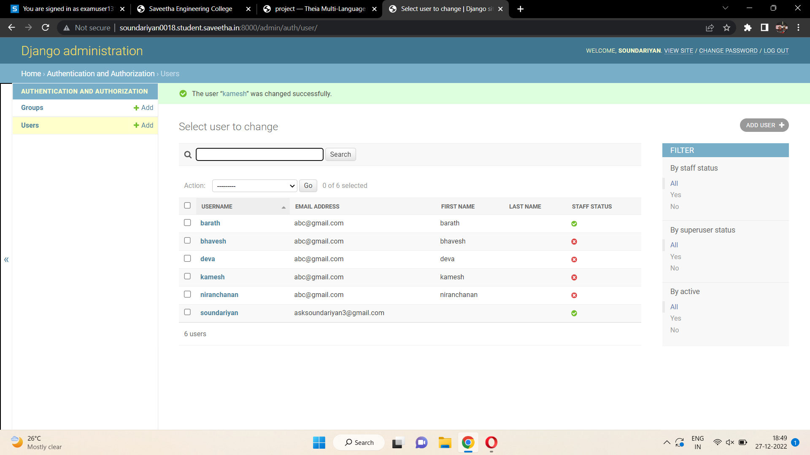

django# Django ORM Web Application

## AIM
To develop a Django application to store and retrieve data from a database using Object Relational Mapping(ORM).

## Entity Relationship Diagram

Include your ER diagram here

## DESIGN STEPS

### STEP 1:
clone the repository from web

### STEP 2:
clone the repository from theia 

### STEP 3:
make the changes from setting.py admin.py

Write your own steps

## PROGRAM

from django.db import models
from django.contrib import admin
# Create your models here.
```python
class student(models.Model):

    reference_no=models.CharField(max_length=75,
    help_text='Reference_No.')
    name=models.CharField(max_length=100,help_text='Name')
    email=models.EmailField(help_text='Email')
    age=models.IntegerField(help_text='Age')
    Class=models.IntegerField(help_text='Class')
class studentAdmin(admin.ModelAdmin):
    list_display=('reference_no','name','email','age','Class')

```

Include your code here

## OUTPUT


Include the screenshot of your admin page.


## RESULT
